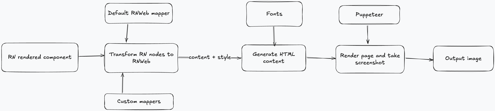

# Contributing Guidelines

Thank you for considering contributing to this project! This document outlines the process for contributing.

## Architecture of the library

The library takes a React Native component as an input and returns a screenshot of the component as an output.

The process is divided into 3 steps:

- transforming the tree of React Native components into a tree of React web components
- rendering the tree of React web components into an HTML string
- processing the HTML string into a screenshot

### RN component -> RN web component

The first step is to transform React Native nodes into React web nodes. This is done by traversing the tree of React Native nodes and replacing each node with a corresponding React web node, with the right type and appropriate props.

Most of the mapping process relies on the `react-native-web` package, which provides a set of components to render base React Native components on the web. However, some components are not supported by `react-native-web` (such as SVG components) and need to be replaced using a custom mapping. Custom mappings are provided in configuration.

The transformation function returns a tree of React web Elements, which can be rendered on the web.

### React web components -> HTML

The second step is to render the tree of React Native Web components into an HTML string. This is done by merging into a single file the content and styles of the components, and rendering them into a string. React DOM handles the rendering of the components into HTML.

Fonts are added at this step, so that the text is rendered correctly in the screenshot. The path to the font files is resolved using configuration.

This step returns an HTML string, which can be rendered in a browser.

### HTML -> Screenshot

The third step is to render the HTML string into a screenshot. This is done by using a headless browser to render the HTML string and take a screenshot of the rendered content. We use Puppeteer for this purpose.
